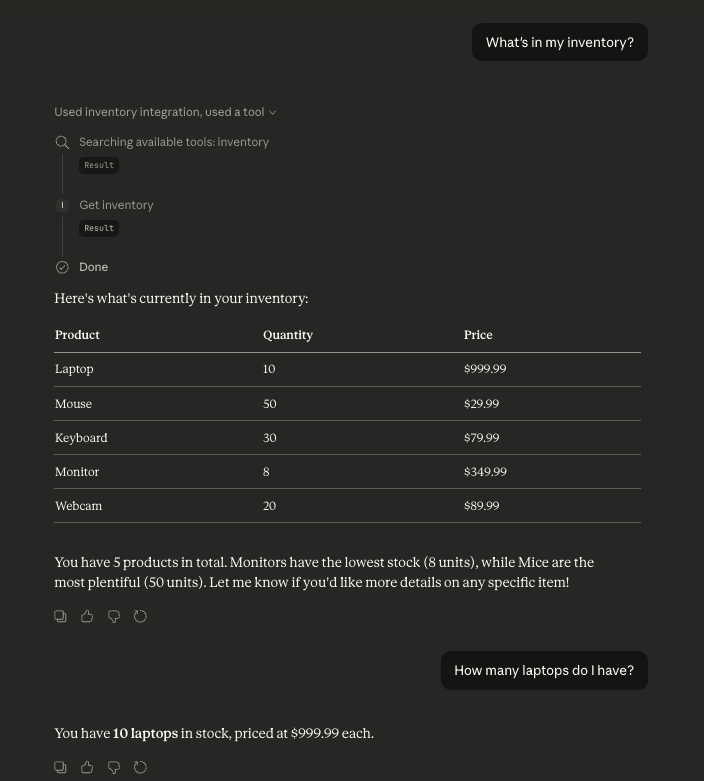

# v0.1 — Raw MCP: Claude + SQLite Inventory Server

> Build a local MCP server from scratch that connects Claude Desktop to a SQLite database — no frameworks, no cloud, no cost.

---

## What Is This?

This is the first project in a series building toward a full AI-powered supply chain system. In this version, we wire up **Claude Desktop** to a **local SQLite database** using the **MCP (Model Context Protocol)** SDK — raw, no abstractions, no magic.

The result: you can open Claude and ask *"What's in my inventory?"* and Claude will actually query your local database and return real data — not a hallucination, not a cached answer, but a live SQL query result.



---

## What Is MCP?

**Model Context Protocol (MCP)** is an open protocol by Anthropic that lets AI models talk to external tools and data sources in a structured way.

Instead of Claude only knowing what you type, MCP lets you expose **tools** — functions Claude can call to fetch data, run queries, trigger actions, and more.

Think of it as giving Claude a phone it can use to call your systems.

---

## Architecture

```
┌─────────────────────────────────────────────────────────┐
│                      YOUR COMPUTER                       │
│                                                          │
│   ┌─────────────┐    stdio      ┌──────────────────┐    │
│   │   Claude    │ ◄───────────► │   server.py      │    │
│   │   Desktop   │  (JSON over   │   (MCP Server)   │    │
│   │             │  stdin/out)   │                  │    │
│   └─────────────┘               └────────┬─────────┘    │
│                                          │               │
│                                          │ SQL query     │
│                                          ▼               │
│                                 ┌──────────────────┐     │
│                                 │  inventory.db    │     │
│                                 │  (SQLite)        │     │
│                                 └──────────────────┘     │
└─────────────────────────────────────────────────────────┘
```


### The 3 Layers

| Layer | What It Is | What It Does |
|---|---|---|
| **Claude Desktop** | The AI interface | Understands your question, decides when to call a tool, formats the response |
| **server.py** | The MCP server | Registers tools, receives tool calls from Claude, runs SQL queries, returns results |
| **inventory.db** | SQLite database | Stores product data on your local disk |

### How Communication Works

The key insight: **MCP does not use HTTP**. It uses **stdio** — standard input and output streams.

```
You ask Claude a question
        ↓
Claude decides it needs real data
        ↓
Claude writes a tool call as JSON → server.py stdin
        ↓
server.py runs SQL query against inventory.db
        ↓
server.py writes result as JSON → Claude stdout
        ↓
Claude reads result, forms a natural language answer
        ↓
You see the answer
```

This is why the server runs entirely offline. No internet. No API calls. Just two processes passing JSON back and forth over pipes.

---

## Project Structure

```
mcp-to-a2a/
├── server.py          ← MCP server (the bridge)
├── inventory.db       ← SQLite database (auto-created on first run)
└── requirements.txt   ← Only one dependency: mcp[cli]
```

---

## Tools Exposed to Claude

This server registers 2 tools that Claude can call:

### `get_inventory`
Returns all products in the database.

```json
Input:  {}
Output: [
  { "id": 1, "product": "Laptop", "quantity": 10, "price": 999.99 },
  { "id": 2, "product": "Mouse",  "quantity": 50, "price": 29.99  },
  ...
]
```

### `get_product`
Looks up a single product by name (case-insensitive).

```json
Input:  { "product": "Laptop" }
Output: { "id": 1, "product": "Laptop", "quantity": 10, "price": 999.99 }
```

---

## Setup & Installation

### Prerequisites
- Mac / Linux / Windows
- Python 3.10+
- [Claude Desktop](https://claude.ai/download) (free)

### 1. Clone / create the project folder
```bash
mkdir my-mcp-server && cd my-mcp-server
```

### 2. Create a virtual environment
```bash
python3 -m venv venv
source venv/bin/activate  # Mac/Linux
```

### 3. Install dependencies
```bash
pip install -r requirements.txt
```

### 4. Test the server locally
```bash
python3 server.py
```
You should see the server start. Press `Ctrl+C` to stop.

### 5. Connect to Claude Desktop

Edit the Claude Desktop config file:
- **Mac:** `~/Library/Application Support/Claude/claude_desktop_config.json`
- **Windows:** `%APPDATA%\Claude\claude_desktop_config.json`

Add the `mcpServers` block:
```json
{
  "mcpServers": {
    "inventory": {
      "command": "/path/to/your/venv/bin/python3",
      "args": ["/path/to/your/server.py"]
    }
  }
}
```

> ⚠️ Use the **absolute path** to both the venv Python and server.py. Relative paths will fail because Claude Desktop runs the server from a different working directory.

### 6. Restart Claude Desktop
```bash
pkill -x "Claude"   # Mac
```
Reopen Claude — you should see the server listed as **running** in Settings → MCP Servers.

---

## Try It Out

Open Claude Desktop and ask:

- *"What's in my inventory?"*
- *"How many laptops do I have?"*
- *"Look up the webcam for me"*

Claude will call your tools and return live data from your SQLite database.

---

## What I Learned Building This

### 1. stdout must be pure JSON
Any `print()` to stdout breaks the connection. Claude Desktop reads stdout as MCP protocol — even a single debug line causes a JSON parse error. Always log to `stderr`:
```python
print("debug message", file=sys.stderr)
```

### 2. Always use absolute paths for the database
SQLite's `connect("inventory.db")` resolves relative to the **current working directory** — which is not your project folder when Claude Desktop launches the script. Fix:
```python
DB_PATH = os.path.join(os.path.dirname(os.path.abspath(__file__)), "inventory.db")
```

### 3. MCP is simpler than it looks
No HTTP server, no port, no network. Just stdin/stdout pipes between two processes. Once you understand that, the whole protocol becomes much less intimidating.

### 4. Claude decides when to call tools
You don't tell Claude "use the get_inventory tool." You just ask naturally. Claude reads the tool descriptions and figures out when to call them. Writing good `description` fields in your tools matters a lot.

---

## What's Next — v0.2

In the next version, we expand the server with 4 proper tools:

| Tool | What It Does |
|---|---|
| `read_stock` | Read current stock level for a product |
| `write_stock` | Update stock quantity |
| `search_product` | Search products by partial name or filter |
| `update_price` | Change the price of a product |

We'll also benchmark tool call latency vs data size and publish the results.

---

## Tech Stack

| Tool | Purpose | Cost |
|---|---|---|
| Claude Desktop | AI interface | Free |
| Python 3.13 | Runtime | Free |
| `mcp[cli]` | MCP SDK | Free (pip) |
| SQLite | Database | Built into Python |

**Total cost: $0**