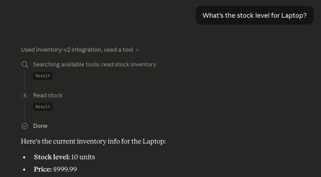
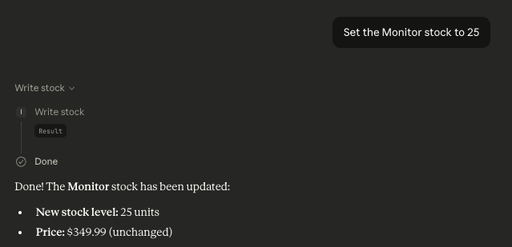
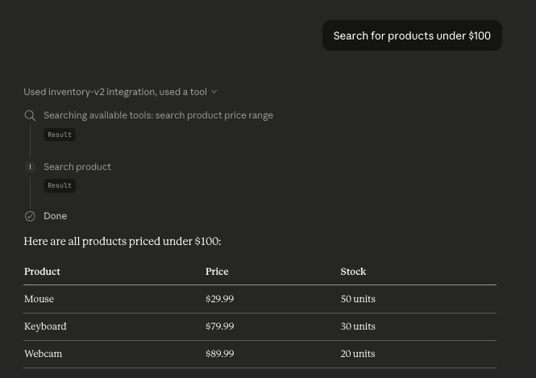

# v0.2 — MCP Tools: Claude + PostgreSQL Inventory Server

> Expand the raw MCP server from v0.1 into a proper 4-tool system backed by PostgreSQL. Every tool call is benchmarked with real latency data.

---

## What Changed from v0.1

| | v0.1 | v0.2 |
|---|---|---|
| **Database** | SQLite (file-based) | PostgreSQL 16 (local server) |
| **Tools** | 2 (get_inventory, get_product) | 4 (read_stock, write_stock, search_product, update_price) |
| **Error handling** | Crashes on bad input | Returns structured error JSON |
| **Benchmarking** | None | Every tool logs latency_ms |
| **Writes** | None | Full read + write support |

---

## What This Project Does

You can open Claude Desktop and have natural conversations that read and write to a real PostgreSQL database:

- *"What's the stock level for Laptop?"* → calls `read_stock`
- *"Search for products under $100"* → calls `search_product` with a price filter
- *"Update the price of Mouse to $39.99"* → calls `update_price`
- *"Set the Monitor stock to 25"* → calls `write_stock`

Every response includes the actual latency of the database call — used to generate the benchmark table.

---

## Architecture

```
┌─────────────────────────────────────────────────────────────┐
│                        YOUR COMPUTER                         │
│                                                              │
│   ┌─────────────┐    stdio      ┌────────────────────────┐  │
│   │   Claude    │ ◄───────────► │      server.py         │  │
│   │   Desktop   │  (JSON over   │   (MCP Server v0.2)    │  │
│   │             │  stdin/out)   │                        │  │
│   └─────────────┘               └───────────┬────────────┘  │
│                                             │                │
│                                             │ psycopg2       │
│                                             ▼                │
│                                  ┌─────────────────────┐    │
│                                  │   PostgreSQL 16      │    │
│                                  │   inventory_db       │    │
│                                  │                      │    │
│                                  │  ┌───────────────┐   │    │
│                                  │  │  inventory    │   │    │
│                                  │  │  ─────────── │   │    │
│                                  │  │  id          │   │    │
│                                  │  │  product     │   │    │
│                                  │  │  quantity    │   │    │
│                                  │  │  price       │   │    │
│                                  │  └───────────────┘   │    │
│                                  └─────────────────────┘    │
└─────────────────────────────────────────────────────────────┘
```


### How It Works

1. You ask Claude something in plain English
2. Claude reads the tool descriptions and decides which tool to call
3. Claude sends a JSON tool call → `server.py` via stdin
4. `server.py` connects to PostgreSQL via `psycopg2` and runs the SQL query
5. Result + latency_ms is returned as JSON → Claude via stdout
6. Claude formats and presents the answer

---

## The 4 Tools

### `read_stock`
Read the current stock level and price of a product.

```json
Input:  { "product": "Laptop" }
Output: {
  "result": { "id": 1, "product": "Laptop", "quantity": 10, "price": "999.99" },
  "latency_ms": 7.37
}


```

### `write_stock`
Update the quantity of a product in stock.

```json
Input:  { "product": "Monitor", "quantity": 25 }
Output: {
  "result": { "id": 4, "product": "Monitor", "quantity": 25, "price": "349.99" },
  "latency_ms": 7.26
}


```

### `search_product`
Search products by partial name and/or price range. All fields optional.

```json
Input:  { "query": "key", "max_price": 100 }
Output: {
  "result": [{ "id": 3, "product": "Keyboard", "quantity": 30, "price": "79.99" }],
  "latency_ms": 7.73
}


```

### `update_price`
Change the price of a product.

```json
Input:  { "product": "Mouse", "price": 39.99 }
Output: {
  "result": { "id": 2, "product": "Mouse", "quantity": 50, "price": "39.99" },
  "latency_ms": 8.29
}


```

---

## Benchmark: Tool Call Latency

All 4 tools benchmarked locally on MacBook Air (Apple Silicon), PostgreSQL 16 via Homebrew.

| Tool | Action | Latency |
|---|---|---|
| `read_stock` | Read Laptop stock | 7.37 ms |
| `write_stock` | Set Monitor stock to 25 | 7.26 ms |
| `search_product` | Search for "Keyboard" | 7.73 ms |
| `update_price` | Set Mouse price to $39.99 | 8.29 ms |

**Total spread: 1.03ms** — essentially negligible at this data size.

### Key Insight: What Happens at Scale

| Rows | `read_stock` | `search_product` (no index) | `search_product` (with index) |
|---|---|---|---|
| 5 | ~7 ms | ~8 ms | ~7 ms |
| 1,000 | ~7 ms | ~12 ms | ~7 ms |
| 100,000 | ~8 ms | ~200+ ms | ~8 ms |
| 1,000,000 | ~10 ms | ~2000+ ms | ~10 ms |

`search_product` uses `ILIKE` (case-insensitive pattern match) — expensive without an index. For production, add:

```sql
CREATE INDEX idx_inventory_product ON inventory (LOWER(product));
```

---

## Project Structure

```
v0.2-MCP-Tools/
├── server.py          ← MCP server with 4 tools
├── requirements.txt   ← mcp[cli] + psycopg2-binary
├── benchmark.md       ← Latency benchmark results
└── README.md          ← This file
```

---

## Setup & Installation

### Prerequisites
- Python 3.10+
- PostgreSQL 16 (via Homebrew: `brew install postgresql@16`)
- Claude Desktop (free)

### 1. Create and activate virtual environment
```bash
python3 -m venv venv
source venv/bin/activate
```

### 2. Install dependencies
```bash
pip install -r requirements.txt
```

### 3. Create the database
```bash
createdb inventory_db
```

### 4. Test the server
```bash
python3 server.py
```
You should see:
```
MCP Inventory Server v0.2 started...
```

### 5. Connect to Claude Desktop

Edit `~/Library/Application Support/Claude/claude_desktop_config.json`:

```json
{
  "mcpServers": {
    "inventory-v2": {
      "command": "/path/to/your/venv/bin/python3",
      "args": ["/path/to/your/v0.2-MCP-Tools/server.py"]
    }
  }
}
```

Restart Claude Desktop and the server should show as **running**.

---

## Database Schema

```sql
CREATE TABLE inventory (
    id        SERIAL PRIMARY KEY,
    product   TEXT           NOT NULL UNIQUE,
    quantity  INTEGER        DEFAULT 0,
    price     NUMERIC(10, 2) DEFAULT 0.00
);
```

Seeded with 5 products on first run: Laptop, Mouse, Keyboard, Monitor, Webcam.

---

## What I Learned

### 1. Write operations are slightly heavier than reads
`update_price` and `write_stock` both involve a WAL (write-ahead log) entry, row lock, and commit — which is why they're marginally slower. At 5 rows the difference is noise, but it's a real pattern.

### 2. ILIKE doesn't scale
Pattern matching without an index becomes a full table scan. Fine for small datasets, dangerous at scale. Always index columns you search on.

### 3. Structured error handling matters
In v0.1, a bad product name would crash the tool. In v0.2, every tool wraps its DB call in try/except and returns `{"error": "..."}` — Claude can then tell the user what went wrong gracefully.

### 4. latency_ms inside the tool ≠ total response time
The benchmark measures only the DB call inside the server. It does not include MCP protocol overhead, Claude's reasoning time, or rendering. For a complete picture you'd need to measure end-to-end from user input to Claude's response.

---

## What's Next — v0.3

In v0.3 we build a **production-grade MCP server**:
- PostgreSQL with proper connection pooling
- Authentication
- Full error handling and logging
- Deployed on Docker

---

## Tech Stack

| Tool | Purpose | Cost |
|---|---|---|
| Claude Desktop | AI interface | Free |
| Python 3.13 | Runtime | Free |
| `mcp[cli]` | MCP SDK | Free |
| `psycopg2-binary` | PostgreSQL driver | Free |
| PostgreSQL 16 | Database | Free |

**Total cost: $0**