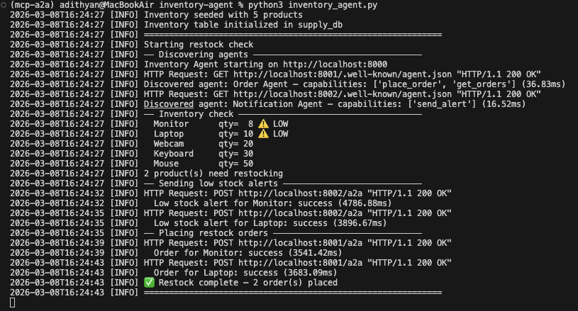

# v0.5 — Agent Cards: Three Agents Discovering Each Other

> Build 3 production-grade agents with rich Agent Cards, test discovery between all of them, and find out where Agent Cards break.

---

## What Are Agent Cards?

In v0.4 we had two agents talking to each other with a basic Agent Card — just a name, URL and a list of capabilities.

In v0.5 we go deeper. A proper Agent Card is a **machine-readable contract** that tells other agents:

- What the agent can do (`capabilities`)
- How to call each skill (`input_schema`)
- What to expect back (`output_schema`)
- How to authenticate (`authentication`)

Think of it like an OpenAPI spec, but for agents instead of humans.

```json
{
  "name": "Order Agent",
  "capabilities": ["place_order", "get_orders"],
  "skills": [
    {
      "name": "place_order",
      "input_schema": {
        "type": "object",
        "properties": {
          "product":  { "type": "string" },
          "quantity": { "type": "integer" }
        },
        "required": ["product", "quantity"]
      },
      "output_schema": {
        "type": "object",
        "properties": {
          "status": { "type": "string" },
          "order":  { "type": "object" }
        }
      }
    }
  ]
}
```

---

## What This Project Does

Three agents run independently, discover each other via Agent Cards, and coordinate a full restock workflow — with no human involvement:

```
1. Inventory Agent starts up
       ↓
2. Discovers Order Agent + Notification Agent via Agent Cards
       ↓
3. Detects low stock products (Monitor: 8, Laptop: 10)
       ↓
4. Sends low_stock alert → Notification Agent → Email
       ↓
5. Places restock orders → Order Agent → orders DB
       ↓
6. Order Agent sends order_placed alert → Notification Agent → Email
```

---

## Architecture

```
┌──────────────────────────────────────────────────────────────────────┐
│                            YOUR MACHINE                               │
│                                                                       │
│  ┌─────────────────────┐                                             │
│  │   Inventory Agent    │  port 8000                                 │
│  │   check_stock        │                                             │
│  │   trigger_restock    │                                             │
│  └──────────┬───────────┘                                             │
│             │                                                         │
│     ┌───────┴────────┐                                               │
│     │ A2A Discovery  │  GET /.well-known/agent.json                  │
│     └───────┬────────┘                                               │
│             │                                                         │
│    ┌────────▼──────────────────────────┐                             │
│    │                                   │                             │
│    ▼                                   ▼                             │
│  ┌──────────────────────┐   ┌─────────────────────────┐             │
│  │    Order Agent        │   │   Notification Agent     │             │
│  │    port 8001          │   │   port 8002              │             │
│  │    place_order        │   │   send_alert             │             │
│  │    get_orders         │   │   (Gmail SMTP)           │             │
│  └──────────┬────────────┘   └──────────────────────────┘             │
│             │  also notifies                ▲                         │
│             └──────────────────────────────►│                         │
│                                                                       │
│  ┌──────────────────────────────────────────────────────────────┐    │
│  │                      supply_db (PostgreSQL)                    │    │
│  │   inventory table                  orders table               │    │
│  │   product, quantity, price         product, quantity, status   │    │
│  └──────────────────────────────────────────────────────────────┘    │
└──────────────────────────────────────────────────────────────────────┘
```

---

## Screenshots

### Inventory Agent Running



*Inventory Agent detects 2 low stock products (Monitor: 8, Laptop: 10), discovers both Order and Notification agents via Agent Cards, sends alerts and places restock orders autonomously.*

---

## The 3 Agents

### Inventory Agent (port 8000)

Monitors stock and orchestrates the restock workflow.

| Skill | What it does |
|---|---|
| `check_stock` | Returns all products + low stock list |
| `trigger_restock` | Runs full restock flow for all or one product |

**On startup:** automatically runs a restock check in a background thread.
**Agent Card caching:** discovers Order + Notification agents once, reuses the card — no redundant HTTP calls.

### Order Agent (port 8001)

Receives restock requests and persists orders.

| Skill | What it does |
|---|---|
| `place_order` | Creates an order in `supply_db` |
| `get_orders` | Returns all placed orders |

After every successful order, automatically notifies the Notification Agent.

### Notification Agent (port 8002)

Sends HTML emails via Gmail SMTP for any inventory event.

| Skill | Event types supported |
|---|---|
| `send_alert` | `low_stock`, `order_placed`, `restock_complete` |

---

## Project Structure

```
v0.5-Agent-Cards/
├── requirements.txt
├── screenshots/
│   └── agents-running.png
├── inventory-agent/
│   ├── inventory_agent.py
│   └── .env
├── order-agent/
│   ├── order_agent.py
│   └── .env
└── notification-agent/
    ├── notification_agent.py
    └── .env
```

---

## Setup & Running

### Prerequisites
- Python 3.10+
- PostgreSQL 16
- Gmail account with App Password enabled

### 1. Create the database
```bash
createdb supply_db
```

### 2. Install dependencies
```bash
pip install -r requirements.txt
```

### 3. Configure each agent's `.env`

**inventory-agent/.env:**
```
DB_NAME=supply_db
DB_USER=your_user
DB_PASSWORD=
DB_HOST=localhost
DB_PORT=5432
ORDER_AGENT_URL=http://localhost:8001
NOTIFICATION_AGENT_URL=http://localhost:8002
RESTOCK_THRESHOLD=15
RESTOCK_QUANTITY=20
```

**order-agent/.env:**
```
DB_NAME=supply_db
DB_USER=your_user
DB_PASSWORD=
DB_HOST=localhost
DB_PORT=5432
NOTIFICATION_AGENT_URL=http://localhost:8002
```

**notification-agent/.env:**
```
SMTP_HOST=smtp.gmail.com
SMTP_PORT=587
SMTP_USER=your_gmail@gmail.com
SMTP_PASSWORD=your_16_char_app_password
ALERT_RECIPIENT=your_gmail@gmail.com
```

### 4. Start agents in order

**Terminal 1 — Notification Agent first:**
```bash
cd notification-agent
python3 notification_agent.py
```

**Terminal 2 — Order Agent:**
```bash
cd order-agent
python3 order_agent.py
```

**Terminal 3 — Inventory Agent (triggers everything):**
```bash
cd inventory-agent
python3 inventory_agent.py
```

### 5. Verify Agent Cards
```bash
curl http://localhost:8000/.well-known/agent.json
curl http://localhost:8001/.well-known/agent.json
curl http://localhost:8002/.well-known/agent.json
```

### 6. Manually trigger a restock
```bash
curl -X POST http://localhost:8000/a2a \
  -H "Content-Type: application/json" \
  -d '{"task": "trigger_restock"}'
```

---

## Where Agent Cards Work — and Where They Break

### ✅ Where they work well

**1. Runtime capability negotiation**
An agent reads another's card and decides whether to call it based on what it finds. If the Order Agent didn't have `place_order` in its capabilities, the Inventory Agent could skip it gracefully rather than failing.

**2. Self-documenting interfaces**
The input/output schemas in the card are the contract. No external docs needed — the agent describes itself.

**3. Decoupled deployment**
Each agent only needs to know the other's URL. Change the Order Agent's implementation completely — as long as the card and `/a2a` endpoint stay the same, nothing else breaks.

**4. Discovery caching**
Fetch the card once, cache it, reuse it. The one-time discovery cost (~36ms locally) disappears after the first run.

### ❌ Where they break

**1. No schema validation enforcement**
The input/output schemas in the card are documentation, not enforcement. An agent can send anything to `/a2a` regardless of what the schema says — there's nothing stopping a malformed request at the protocol level.

**2. No versioning strategy**
All 3 agents are `version: 0.5.0` but there's no mechanism to handle what happens when the Order Agent upgrades to `0.6.0` with a breaking change. Callers have no way to know.

**3. Cards can lie**
An agent can advertise `capabilities: ["place_order"]` and then return errors for every request. There's no health check or capability verification built into the protocol.

**4. Discovery latency adds up**
With 3 agents, discovery costs ~50ms total. With 20 agents in a mesh, that's ~300ms of discovery overhead on every cold start — without caching.

**5. No standard auth**
The `authentication` field in the card is free-form text. There's no enforced standard — every agent can describe auth differently, leaving the caller to interpret it manually.

---

## Benchmark

| Step | Latency |
|---|---|
| Discover Order Agent | 36.83ms |
| Discover Notification Agent | 16.52ms |
| Send low_stock alert (Monitor) | 4786ms* |
| Send low_stock alert (Laptop) | 3896ms* |
| Place order (Monitor) | 3541ms* |
| Place order (Laptop) | 3683ms* |

*High latency is Gmail SMTP email sending — not A2A protocol overhead. Pure A2A call latency is under 30ms.

**Key insight:** Email is the bottleneck, not A2A. If you replace SMTP with a webhook or a queue, the entire workflow completes in under 200ms.

---

## What I Learned

### 1. Agent Cards are contracts, not guarantees
The schema tells you what an agent *claims* to accept. Nothing enforces it. You still need error handling on every call.

### 2. Start order matters
The Notification Agent must be running before the Order Agent, and the Order Agent before the Inventory Agent. In production you'd add retry logic with backoff.

### 3. Cache Agent Cards aggressively
Discovery is cheap (~36ms) but it adds up across many agents. Cache the card after first fetch and only re-discover on failure.

### 4. SMTP is slow — use it async
Email sending blocks the entire A2A response. In production, push email jobs to a queue and return the A2A response immediately.

---

## What's Next — v0.6

In v0.6 we combine MCP + A2A together for the first time:
- Inventory Agent (MCP → DB) triggers Order Agent (A2A) automatically
- Architecture diagram + flow walkthrough video

---

## Tech Stack

| Tool | Purpose | Cost |
|---|---|---|
| Python 3.13 | Runtime | Free |
| FastAPI | Agent HTTP servers | Free |
| uvicorn | ASGI server | Free |
| httpx | A2A HTTP calls | Free |
| psycopg2-binary | PostgreSQL driver | Free |
| python-dotenv | Config from .env | Free |
| PostgreSQL 16 | supply_db | Free |
| Gmail SMTP | Email alerts | Free |

**Total cost: $0**