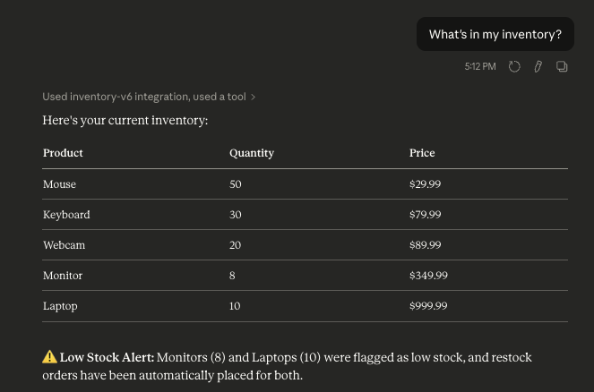
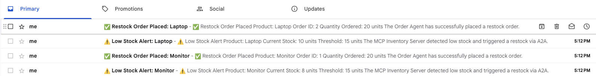

# v0.6 — MCP + A2A Together: Claude Triggers a Real Pipeline

> Combine MCP and A2A for the first time. One message to Claude reads the inventory, detects low stock, and automatically fires a full restock pipeline — alerts, orders, and emails — with zero extra prompting.

---

## What Changed from v0.5

| | v0.5 | v0.6 |
|---|---|---|
| **Trigger** | Run `inventory_agent.py` manually | Ask Claude a question |
| **Entry point** | Python script | MCP tool call from Claude Desktop |
| **Protocol** | A2A only | MCP + A2A together |
| **Human involvement** | Run the script | Just ask Claude |
| **Claude awareness** | None | Claude sees inventory + pipeline results |

---

## What This Project Does

You ask Claude *"What's in my inventory?"* — and this happens automatically:

```
1. Claude calls get_inventory via MCP
        ↓
2. MCP server reads pipeline_db
        ↓
3. Detects low stock: Monitor (8) + Laptop (10)
        ↓
4. Fires A2A → Notification Agent → ⚠️ Low Stock Alert emails
        ↓
5. Fires A2A → Order Agent → places restock orders
        ↓
6. Order Agent fires A2A → Notification Agent → ✅ Order Placed emails
        ↓
7. Claude responds with inventory table + pipeline summary
```

One question. Four emails. Two restock orders. Zero extra steps.

---

## Architecture

```
┌─────────────────────────────────────────────────────────────────────────┐
│                             YOUR MACHINE                                  │
│                                                                           │
│   ┌─────────────┐   stdio    ┌────────────────────────────────────────┐  │
│   │   Claude    │◄──────────►│         mcp-server/server.py           │  │
│   │   Desktop   │            │         (MCP Inventory Server v0.6)    │  │
│   └─────────────┘            │                                        │  │
│                               │  1. Read inventory (PostgreSQL)        │  │
│                               │  2. Detect low stock                   │  │
│                               │  3. trigger_restock_pipeline()         │  │
│                               └──────────────┬─────────────────────────┘  │
│                                              │                            │
│                               ┌──────────────▼──────────────┐            │
│                               │     A2A layer                │            │
│                               └──────┬───────────────┬───────┘            │
│                                      │               │                    │
│                         ┌────────────▼──┐     ┌──────▼──────────────┐    │
│                         │  Order Agent  │     │ Notification Agent   │    │
│                         │  port 8001    │     │ port 8002            │    │
│                         │  place_order  │     │ send_alert           │    │
│                         └──────┬────────┘     │ Gmail SMTP           │    │
│                                │ also         └──────────────────────┘    │
│                                │ notifies ───────────────────────────►    │
│                                │                                          │
│   ┌────────────────────────────▼──────────────────────────────────────┐   │
│   │                      pipeline_db (PostgreSQL)                      │   │
│   │   inventory table                      orders table                │   │
│   └───────────────────────────────────────────────────────────────────┘   │
└─────────────────────────────────────────────────────────────────────────┘
```

### The Key Bridge: `trigger_restock_pipeline()`

This function inside `server.py` is what makes v0.6 different from everything before it. It lives inside the MCP server and fires automatically when low stock is detected:

```python
def trigger_restock_pipeline(product, quantity, price):
    # Step 1 — Alert via A2A
    send_a2a(NOTIFICATION_AGENT_URL, {
        "task": "send_alert",
        "event_type": "low_stock",
        "product": product,
        "details": {"quantity": quantity, "threshold": RESTOCK_THRESHOLD}
    })

    # Step 2 — Restock via A2A
    send_a2a(ORDER_AGENT_URL, {
        "task": "place_order",
        "product": product,
        "quantity": RESTOCK_QUANTITY
    })
```

MCP handles the Claude ↔ data layer. A2A handles the agent ↔ agent layer. `trigger_restock_pipeline()` is the bridge between them.

---

## Screenshots

### Claude Desktop — One Question, Full Pipeline



*Claude reads the inventory via MCP, detects Monitor (8) and Laptop (10) as low stock, and automatically triggers the full A2A restock pipeline. The response includes the inventory table and a low stock alert summary.*

---

### Gmail Inbox — 4 Emails at 5:12 PM



*Four emails arrive simultaneously — triggered by a single Claude question. Two low stock alerts (MCP server → Notification Agent) and two restock confirmations (Order Agent → Notification Agent). All at exactly 5:12 PM.*

---

## The 5 MCP Tools

All tools from v0.3 are back, but `get_inventory` and `read_stock` now auto-trigger the A2A pipeline when low stock is detected.

| Tool | What it does | Auto-triggers A2A? |
|---|---|---|
| `get_inventory` | Returns all products | ✅ Yes — for every low stock item |
| `read_stock` | Returns one product | ✅ Yes — if that product is low |
| `write_stock` | Updates quantity | No |
| `search_product` | Search by name/price | No |
| `update_price` | Updates price | No |

---

## Project Structure

```
v0.6-MCP-A2A/
├── requirements.txt
├── screenshots/
│   ├── claude-response.png
│   └── gmail-inbox.png
├── mcp-server/
│   ├── server.py            ← MCP server + A2A bridge
│   └── .env
├── order-agent/
│   ├── order_agent.py       ← receives A2A orders, notifies on completion
│   └── .env
└── notification-agent/
    ├── notification_agent.py ← sends HTML emails via Gmail SMTP
    └── .env
```

---

## Setup & Running

### Prerequisites
- Python 3.10+
- PostgreSQL 16
- Claude Desktop
- Gmail App Password

### 1. Create the database
```bash
createdb pipeline_db
```

### 2. Install dependencies
```bash
pip install -r requirements.txt
```

### 3. Configure `.env` files

**mcp-server/.env:**
```
DB_NAME=pipeline_db
DB_USER=your_user
DB_PASSWORD=
DB_HOST=localhost
DB_PORT=5432
ORDER_AGENT_URL=http://localhost:8001
NOTIFICATION_AGENT_URL=http://localhost:8002
RESTOCK_THRESHOLD=15
RESTOCK_QUANTITY=20
```

**order-agent/.env:**
```
DB_NAME=pipeline_db
DB_USER=your_user
DB_PASSWORD=
DB_HOST=localhost
DB_PORT=5432
NOTIFICATION_AGENT_URL=http://localhost:8002
```

**notification-agent/.env:**
```
SMTP_HOST=smtp.gmail.com
SMTP_PORT=587
SMTP_USER=your_gmail@gmail.com
SMTP_PASSWORD=your_16_char_app_password
ALERT_RECIPIENT=your_gmail@gmail.com
```

### 4. Start agents in order

**Terminal 1:**
```bash
cd notification-agent && python3 notification_agent.py
```

**Terminal 2:**
```bash
cd order-agent && python3 order_agent.py
```

### 5. Connect MCP server to Claude Desktop

Edit `~/Library/Application Support/Claude/claude_desktop_config.json`:
```json
{
  "mcpServers": {
    "inventory-v6": {
      "command": "/path/to/venv/bin/python3",
      "args": ["/path/to/v0.6-MCP-A2A/mcp-server/server.py"]
    }
  }
}
```

Restart Claude Desktop.

### 6. Test the full pipeline

Ask Claude:
> *"What's in my inventory?"*

Then check your Gmail inbox — you should receive 4 emails within seconds.

---

## What I Learned

### 1. MCP and A2A solve different problems
MCP is about **Claude ↔ data** — giving Claude access to tools and databases. A2A is about **agent ↔ agent** — letting autonomous services coordinate. They're not competing protocols, they're complementary layers.

### 2. The bridge function is the architecture
`trigger_restock_pipeline()` is just 20 lines of Python. But conceptually it's the most important piece — it's where the MCP world hands off to the A2A world. In larger systems this bridge would be a proper event bus or message queue.

### 3. Claude becomes an orchestrator without knowing it
Claude doesn't know A2A exists. It just calls a tool. The tool happens to trigger a multi-agent pipeline behind the scenes. This is a powerful pattern — Claude as a natural language interface to complex automated workflows.

### 4. Agent Card caching matters at this scale
With 2 A2A agents being discovered on every `get_inventory` call, uncached discovery would add ~100ms overhead to every Claude tool call. The cache brings this to 0ms after the first call.

### 5. Email latency is still the bottleneck
The MCP tool call itself completes in under 50ms. The SMTP email sends add 3–5 seconds per email. For production, replace synchronous SMTP with an async queue — fire the email job and return the A2A response immediately.

---

## End-to-End Latency Breakdown

| Step | Latency |
|---|---|
| Claude → MCP tool call | ~10ms |
| MCP → PostgreSQL query | ~8ms |
| MCP → A2A low stock alert (×2) | ~8,000ms* |
| MCP → A2A restock order (×2) | ~7,000ms* |
| Order Agent → A2A notification (×2) | ~7,000ms* |
| **Total wall time** | **~15–20 seconds** |

*Dominated by synchronous Gmail SMTP. Pure protocol latency (MCP + A2A) is under 100ms total.

---

## What's Next — v0.7

In v0.7 we build 3 mock **Supplier Agents** that respond to bid requests via A2A. The Inventory Agent sends a bid request to all 3 suppliers simultaneously and picks the best response — the first real multi-agent decision in the series.

---

## Tech Stack

| Tool | Purpose | Cost |
|---|---|---|
| Claude Desktop | AI interface | Free |
| Python 3.13 | Runtime | Free |
| `mcp[cli]` | MCP SDK | Free |
| FastAPI + uvicorn | A2A agent servers | Free |
| httpx | A2A HTTP calls | Free |
| psycopg2-binary | PostgreSQL driver | Free |
| python-dotenv | Config management | Free |
| PostgreSQL 16 | pipeline_db | Free |
| Gmail SMTP | Email alerts | Free |

**Total cost: $0**