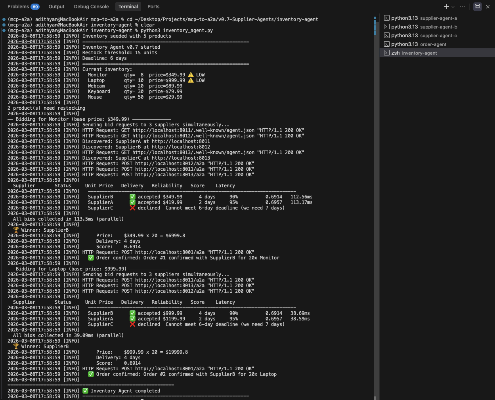

# v0.7 — Supplier Agents: Three Agents Competing for Bids

> Build 3 mock Supplier Agents that respond to bid requests via A2A. The Inventory Agent sends bid requests to all 3 simultaneously, scores responses using a weighted formula, picks the winner and confirms the order.

---

## What This Project Does

When stock runs low, instead of placing an order with a fixed supplier, the Inventory Agent runs a **live bidding process**:

```
1. Inventory Agent detects low stock
        ↓
2. Sends bid requests to all 3 suppliers simultaneously
        ↓
3. Each supplier responds with price, delivery time, reliability
        ↓
4. Inventory Agent scores all bids (price 50% + delivery 30% + reliability 20%)
        ↓
5. Winner selected (lowest score wins)
        ↓
6. Order confirmed with winning supplier via Order Agent
```

---

## Architecture

```
┌──────────────────────────────────────────────────────────────────────┐
│                            YOUR MACHINE                               │
│                                                                       │
│         ┌─────────────────────────────────┐                          │
│         │       Inventory Agent            │                          │
│         │  - reads supplier_db             │                          │
│         │  - detects low stock             │                          │
│         │  - runs bidding process          │                          │
│         └──────────────┬──────────────────┘                          │
│                        │ parallel bid requests                        │
│           ┌────────────┼────────────┐                                │
│           ▼            ▼            ▼                                │
│  ┌──────────────┐ ┌──────────────┐ ┌──────────────┐                 │
│  │  Supplier A   │ │  Supplier B   │ │  Supplier C   │                 │
│  │  port 8011    │ │  port 8012    │ │  port 8013    │                 │
│  │  1.2x price   │ │  1.0x price   │ │  0.85x price  │                 │
│  │  2 days       │ │  4 days       │ │  7 days       │                 │
│  │  95% reliable │ │  90% reliable │ │  80% reliable │                 │
│  └──────────────┘ └──────────────┘ └──────────────┘                 │
│           │ bids scored + winner picked                               │
│           ▼                                                           │
│  ┌──────────────────────┐                                            │
│  │     Order Agent       │  port 8001                                │
│  │  confirms + records   │                                            │
│  └──────────────────────┘                                            │
│           │                                                           │
│  ┌────────▼────────────────────────────────────────────────────┐    │
│  │                    supplier_db (PostgreSQL)                   │    │
│  │   inventory table                  orders table               │    │
│  └─────────────────────────────────────────────────────────────┘    │
└──────────────────────────────────────────────────────────────────────┘
```

---

## The 3 Supplier Designs

All 3 suppliers use the **same code** (`supplier_agent.py`) but different `.env` values — giving each a distinct personality:

| | Supplier A | Supplier B | Supplier C |
|---|---|---|---|
| **Port** | 8011 | 8012 | 8013 |
| **Price** | 1.2x market | 1.0x market | 0.85x market |
| **Delivery** | 2 days | 4 days | 7 days |
| **Reliability** | 95% | 90% | 80% |
| **Profile** | Fast, expensive | Balanced | Cheap, slow |

This is the v0.7 design comparison — one code base, three personalities via config.

---

## Scoring Formula

```
score = (0.5 × price_ratio) + (0.3 × delivery_ratio) + (0.2 × reliability_penalty)

where:
  price_ratio        = unit_price / base_price
  delivery_ratio     = delivery_days / 7
  reliability_penalty = 1 - reliability
```

Lower score = better supplier. Weighted 50% price, 30% delivery, 20% reliability.

### Expected scores with default config:

| Supplier | Price score | Delivery score | Reliability penalty | Final score |
|---|---|---|---|---|
| A | 0.60 | 0.086 | 0.05 | **0.6957** |
| B | 0.50 | 0.171 | 0.10 | **0.6914** |
| C | 0.425 | 0.300 | 0.20 | **0.6800** |

Supplier C has the best theoretical score — but gets eliminated by the 6-day deadline, making Supplier B the consistent winner.

---

## Screenshot

### Inventory Agent — Live Bidding Output



*The Inventory Agent detects 2 low stock products, sends parallel bid requests to all 3 suppliers, scores the responses and picks the winner. Supplier C is automatically eliminated for missing the deadline. Supplier B wins both rounds with score 0.6914. Second round is 3x faster (39ms vs 113ms) because Agent Cards are cached.*

---

## Project Structure

```
v0.7-Supplier-Agents/
├── requirements.txt
├── screenshots/
│   └── inventory-agent.png
├── inventory-agent/
│   ├── inventory_agent.py   ← bidding orchestrator
│   └── .env
├── supplier-agent-a/
│   ├── supplier_agent.py    ← same file for all 3
│   └── .env                 ← personality config
├── supplier-agent-b/
│   ├── supplier_agent.py
│   └── .env
├── supplier-agent-c/
│   ├── supplier_agent.py
│   └── .env
└── order-agent/
    ├── order_agent.py
    └── .env
```

---

## Setup & Running

### Prerequisites
- Python 3.10+
- PostgreSQL 16

### 1. Create the database
```bash
createdb supplier_db
```

### 2. Install dependencies
```bash
pip install -r requirements.txt
```

### 3. Copy supplier_agent.py into all 3 supplier folders
```bash
cp supplier-agent-a/supplier_agent.py supplier-agent-b/supplier_agent.py
cp supplier-agent-a/supplier_agent.py supplier-agent-c/supplier_agent.py
```

### 4. Start all agents

**Terminal 1 — Supplier A:**
```bash
cd supplier-agent-a && python3 supplier_agent.py
```

**Terminal 2 — Supplier B:**
```bash
cd supplier-agent-b && python3 supplier_agent.py
```

**Terminal 3 — Supplier C:**
```bash
cd supplier-agent-c && python3 supplier_agent.py
```

**Terminal 4 — Order Agent:**
```bash
cd order-agent && python3 order_agent.py
```

**Terminal 5 — Inventory Agent:**
```bash
cd inventory-agent && python3 inventory_agent.py
```

---

## Benchmark Results

### Monitor Bidding

| Supplier | Status | Unit Price | Delivery | Reliability | Score | Latency |
|---|---|---|---|---|---|---|
| SupplierB | ✅ accepted | $349.99 | 4 days | 90% | 0.6914 | 112.56ms |
| SupplierA | ✅ accepted | $419.99 | 2 days | 95% | 0.6957 | 113.17ms |
| SupplierC | ❌ declined | — | — | — | — | — |

**Winner: SupplierB** | All bids collected in **113.5ms (parallel)**

### Laptop Bidding

| Supplier | Status | Unit Price | Delivery | Reliability | Score | Latency |
|---|---|---|---|---|---|---|
| SupplierB | ✅ accepted | $999.99 | 4 days | 90% | 0.6914 | 38.69ms |
| SupplierA | ✅ accepted | $1,199.99 | 2 days | 95% | 0.6957 | 38.59ms |
| SupplierC | ❌ declined | — | — | — | — | — |

**Winner: SupplierB** | All bids collected in **39.09ms (parallel)**

### Key observation
Second round was **3x faster** (39ms vs 113ms) — Agent Cards were cached after the first round, eliminating re-discovery overhead entirely.

---

## Which Supplier Design Scaled Best?

### Supplier B — The Consistent Winner
Balanced price (1.0x) and reasonable delivery (4 days) gave it the best score in both rounds. No surprises, no edge cases — just reliable performance.

### Supplier A — Lost on Price
Being 20% more expensive hurt more than being 2 days faster helped. The scoring formula weights price at 50% — speed alone can't overcome a significant price premium.

### Supplier C — Eliminated Before Competing
The 7-day delivery time exceeded the 6-day deadline, so it never got to compete on price (where it would have won). This is the most important design insight: **a great price means nothing if you can't meet the deadline**.

### Design Comparison

| Design | Strengths | Weaknesses | Best for |
|---|---|---|---|
| Supplier A (fast + expensive) | Never misses deadlines | High cost hurts score | Urgent orders where speed is critical |
| Supplier B (balanced) | Wins on overall score | Not the cheapest or fastest | Standard restock orders |
| Supplier C (cheap + slow) | Best unit economics | Deadline risk | Long-lead non-urgent orders |

---

## What I Learned

### 1. Parallel bidding is essential
Sequential requests to 3 suppliers would take ~340ms (3 × 113ms). Parallel requests take 113ms total — the time of the slowest single response. At 10 suppliers this difference becomes critical.

### 2. Deadlines as first-class filters
Supplier C had the best raw price but got eliminated before scoring even ran. Hard constraints (deadlines, minimum quantities, geography) should filter candidates before the scoring formula runs — not after.

### 3. One code, three personalities
All 3 suppliers run identical code with different `.env` values. This is the cleanest way to build comparable agent variants — same interface, different behavior. Makes A/B testing trivial.

### 4. Agent Card caching compounds
First round: 113ms (includes 3 discovery calls). Second round: 39ms (all cached). At 10 products needing restock, caching saves ~740ms of discovery overhead.

### 5. Scoring weights are a business decision
The 50/30/20 split (price/delivery/reliability) encodes a business preference. Change it to 30/50/20 and fast suppliers win more often. Change it to 40/20/40 and reliability becomes the tiebreaker. The formula is the policy.

---

## What's Next — v0.8

In v0.8 we build the **Pricing Agent** — dynamic pricing logic that connects via MCP to a market API and adjusts prices in real-time. We'll also generate a latency vs accuracy tradeoff curve.

---

## Tech Stack

| Tool | Purpose | Cost |
|---|---|---|
| Python 3.13 | Runtime | Free |
| FastAPI + uvicorn | Supplier + Order agent servers | Free |
| httpx | Parallel A2A HTTP calls | Free |
| ThreadPoolExecutor | Parallel bid collection | Built into Python |
| psycopg2-binary | PostgreSQL driver | Free |
| python-dotenv | Per-agent config | Free |
| PostgreSQL 16 | supplier_db | Free |

**Total cost: $0**