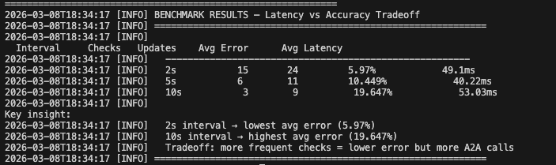

# v0.8 — Pricing Agent: Dynamic Repricing with Latency vs Accuracy Tradeoff

> Build a Pricing Agent that watches a live market price feed, detects drift, and automatically updates inventory prices via A2A. Benchmark 3 reprice intervals to find the optimal tradeoff between accuracy and A2A call volume.

---

## The Problem v0.8 Solves

In v0.7, supplier bid requests included a `base_price` pulled from the DB. That price was static — seeded at startup and never updated. In a real supply chain, market prices move constantly.

If your DB says a Laptop costs $999 but the market price is $1,342 — your supplier quotes are based on stale data and you're making bad purchasing decisions.

**v0.8 fixes this** with a Pricing Agent that keeps DB prices in sync with a live market feed.

---

## What This Project Does

```
1. Market API generates live prices via random walk (ticks every 1s)
        ↓
2. Pricing Agent polls Market API every N seconds
        ↓
3. Compares market price vs DB price for each product
        ↓
4. If drift > 5% threshold → fires A2A update to Inventory Agent
        ↓
5. Inventory Agent updates pricing_db
        ↓
6. Benchmark runs across 3 intervals (2s, 5s, 10s) to measure accuracy vs call volume
```

---

## Architecture

```
┌─────────────────────────────────────────────────────────────────────┐
│                           YOUR MACHINE                               │
│                                                                      │
│  ┌──────────────────────────────────────────┐                       │
│  │           Market API  (port 9000)         │                       │
│  │   random walk price feed — ticks every 1s │                       │
│  │   /prices  /prices/{product}  /history    │                       │
│  └───────────────────┬──────────────────────┘                       │
│                      │ GET /prices (every N seconds)                 │
│                      ▼                                               │
│  ┌──────────────────────────────────────────┐                       │
│  │         Pricing Agent                     │                       │
│  │   - polls market every N seconds          │                       │
│  │   - compares market vs DB price           │                       │
│  │   - fires A2A if drift > 5%               │                       │
│  │   - runs latency vs accuracy benchmark    │                       │
│  └───────────────────┬──────────────────────┘                       │
│                      │ A2A update_price                              │
│                      ▼                                               │
│  ┌──────────────────────────────────────────┐                       │
│  │       Inventory Agent  (port 8000)        │                       │
│  │   - receives price updates via A2A        │                       │
│  │   - updates pricing_db                    │                       │
│  └───────────────────┬──────────────────────┘                       │
│                      │                                               │
│  ┌───────────────────▼──────────────────────┐                       │
│  │         pricing_db  (PostgreSQL)          │                       │
│  │   inventory: product, quantity, price     │                       │
│  └──────────────────────────────────────────┘                       │
└─────────────────────────────────────────────────────────────────────┘
```

---

## The Random Walk Formula

```
new_price = old_price × (1 + drift + volatility × random_normal())

where:
  drift      = 0.001   (0.1% upward bias per tick — simulates inflation)
  volatility = 0.02    (±2% random shock per tick)
  floor      = 10% of base price (prices can't go to zero)
```

This produces realistic price behavior — gradual drift with occasional large moves in either direction.

---

## Screenshot

### Benchmark Results



*The Pricing Agent runs 3 reprice intervals (2s, 5s, 10s) for 30 seconds each. Avg price error grows from 5.97% at 2s to 19.65% at 10s. Latency per call stays flat at ~40–53ms regardless of interval — accuracy degrades, not speed.*

---

## Benchmark Results

### Live Repricing (5s interval, 30 seconds)

| Check | Tick | Products Repriced |
|---|---|---|
| #1 | 293 | All 5 — initial sync from base prices |
| #2 | 298 | 0 — all within threshold |
| #3 | 303 | 0 — drift accumulating |
| #4 | 308 | Laptop (+10.3%), Keyboard (+8.4%) |
| #5 | 313 | Monitor (+6.0%), Webcam (+14.6%) |
| #6 | 318 | Laptop (-7.4%) |

**6 checks, 10 updates in 30 seconds**

---

### Latency vs Accuracy Benchmark

| Interval | Checks | A2A Updates | Avg Price Error | Avg Latency |
|---|---|---|---|---|
| **2s** | 15 | 24 | **5.97%** | 49.1ms |
| **5s** | 6 | 11 | **10.45%** | 40.22ms |
| **10s** | 3 | 9 | **19.65%** | 53.03ms |

---

## The Tradeoff Curve

```
Avg Price Error (%)
20% |                              ●  10s
    |
15% |
    |
10% |              ●  5s
    |
 5% |   ●  2s
    |
 0% └────────────────────────────────────
     0      5      10     15     20     25
                  A2A Updates (per 30s)
```

**Key findings:**

**1. Accuracy degrades non-linearly**
Going from 2s → 5s doubles error (5.97% → 10.45%). Going from 5s → 10s doubles it again (10.45% → 19.65%). Error compounds with time because the random walk keeps moving while your DB sits still.

**2. Latency stays flat**
Each A2A call costs ~40–53ms regardless of how often you call. The protocol overhead is constant — only the accuracy changes with interval.

**3. The 10s surprise**
The 10s interval sent 9 updates — nearly as many as 5s (11 updates) but with 3× worse accuracy. This is because large corrections pile up when you wait longer. Infrequent checks don't reduce total updates much when volatility is high.

**4. The sweet spot**
For this volatility (2%) and threshold (5%), the 5s interval is the best balance — half the A2A calls of 2s with only 4.5% more error. The 2s interval is overkill for a 2% volatility market.

**5. Threshold matters as much as interval**
Lowering the threshold from 5% to 2% would roughly triple A2A call volume at any interval. The threshold is the primary lever for controlling call volume — the interval is secondary.

---

## Project Structure

```
v0.8-Pricing-Agent/
├── requirements.txt
├── screenshots/
│   └── benchmark.png
├── market-api/
│   ├── market_api.py       ← random walk price feed
│   └── .env
├── pricing-agent/
│   ├── pricing_agent.py    ← polls market, triggers A2A repricing + benchmark
│   └── .env
└── inventory-agent/
    ├── inventory_agent.py  ← receives price updates, updates pricing_db
    └── .env
```

---

## Setup & Running

### Prerequisites
- Python 3.10+
- PostgreSQL 16

### 1. Create the database
```bash
createdb pricing_db
```

### 2. Install dependencies
```bash
pip install -r requirements.txt
```

### 3. Configure `.env` files

**market-api/.env:**
```
PORT=9000
VOLATILITY=0.02
DRIFT=0.001
TICK_INTERVAL=1
```

**pricing-agent/.env:**
```
MARKET_API_URL=http://localhost:9000
INVENTORY_AGENT_URL=http://localhost:8000
REPRICE_THRESHOLD=0.05
DB_NAME=pricing_db
DB_USER=your_user
DB_PASSWORD=
DB_HOST=localhost
DB_PORT=5432
```

**inventory-agent/.env:**
```
DB_NAME=pricing_db
DB_USER=your_user
DB_PASSWORD=
DB_HOST=localhost
DB_PORT=5432
```

### 4. Start agents in order

**Terminal 1 — Market API:**
```bash
cd market-api && python3 market_api.py
```

**Terminal 2 — Inventory Agent:**
```bash
cd inventory-agent && python3 inventory_agent.py
```

**Terminal 3 — Pricing Agent (runs benchmark automatically):**
```bash
cd pricing-agent && python3 pricing_agent.py
```

### 5. Watch the market move
```bash
# In a separate tab, watch prices drift in real time
watch -n 1 curl -s http://localhost:9000/prices
```

---

## What I Learned

### 1. Polling interval is a business decision, not a technical one
The right reprice interval depends entirely on your market's volatility and your tolerance for stale prices. A commodity market (low volatility) can poll every 60s. A crypto market (high volatility) might need sub-second polling.

### 2. Threshold filtering is essential
Without a 5% threshold, every single tick would trigger A2A updates — 1 call per product per second = 5 calls/second = 300 calls/minute. The threshold acts as a noise filter, only firing updates when the drift is actually meaningful.

### 3. Random walk is a better simulator than you'd expect
Even with simple Gaussian shocks, the price history shows realistic behavior — trending periods, reversals, occasional large moves. It's not as good as real market data, but it's sufficient for testing repricing logic.

### 4. Error compounds with time
The relationship between interval and error isn't linear — it's closer to quadratic. Each extra second you wait, the market has moved further and the correction needed is larger. This is why the 10s interval has 3× the error of 2s, not 5×.

### 5. A2A call volume matters at scale
24 updates per 30 seconds = 2,880 per hour = ~69,000 per day for 5 products. Scale to 500 products and you're at 7 million A2A calls per day. Threshold tuning and interval selection aren't just academic — they directly control infrastructure cost.

---

## What's Next — v0.9

In v0.9 we build the **full pipeline** — all agents from v0.1 to v0.8 running together end to end. Claude Desktop triggers the whole system: inventory check → pricing sync → supplier bidding → order confirmation → email notification. One message, the whole supply chain.

---

## Tech Stack

| Tool | Purpose | Cost |
|---|---|---|
| Python 3.13 | Runtime | Free |
| FastAPI + uvicorn | Market API + Inventory Agent | Free |
| httpx | A2A HTTP calls | Free |
| psycopg2-binary | PostgreSQL driver | Free |
| python-dotenv | Config management | Free |
| PostgreSQL 16 | pricing_db | Free |
| threading | Background market tick loop | Built into Python |

**Total cost: $0**