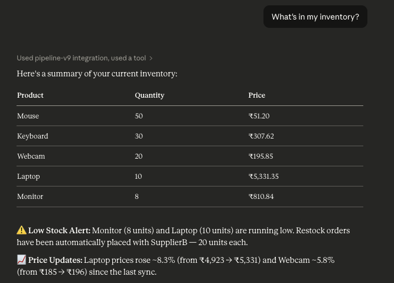
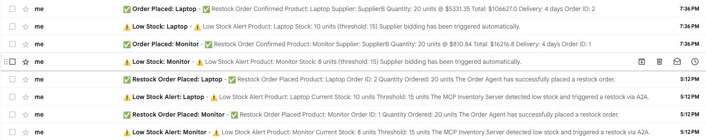

# v0.9 — Full Pipeline: One Claude Message, Nine Agents

> The grand finale. Every agent from v0.1 to v0.8 runs together in a single pipeline. One message to Claude triggers a price sync, inventory check, supplier bidding, order confirmation and email alerts — end to end, fully automated.

---

## What This Project Does

Ask Claude *"What's in my inventory?"* and the entire supply chain runs automatically:

```
1. MCP server receives tool call from Claude
        ↓
2. Pricing Agent syncs live market prices → updates inventory DB
        ↓
3. MCP server reads inventory from DB
        ↓
4. Detects low stock: Monitor (8) + Laptop (10)
        ↓
5. Inventory Agent runs supplier bidding (parallel A2A to A, B, C)
        ↓
6. SupplierB wins both rounds (best score)
        ↓
7. Order Agent confirms orders → records in pipeline_v9_db
        ↓
8. Notification Agent sends 4 emails (2 low stock + 2 order confirmed)
        ↓
9. Claude responds with inventory table + price updates + restock summary
```

One question. Nine agents. Four emails. Zero extra steps.

---

## Architecture

```
┌─────────────────────────────────────────────────────────────────────────────┐
│                              YOUR MACHINE                                    │
│                                                                              │
│  ┌─────────────┐  stdio   ┌──────────────────────────────────────────────┐  │
│  │   Claude    │◄────────►│          MCP Server  (entry point)           │  │
│  │   Desktop   │          │  get_inventory  sync_prices  check_stock     │  │
│  └─────────────┘          │  get_orders     get_market_prices            │  │
│                            └────────────────────┬─────────────────────────┘  │
│                                                 │                            │
│                            ┌────────────────────▼──────────────────────────┐ │
│                            │              A2A Pipeline                      │ │
│                            └──────┬──────────────────────────┬─────────────┘ │
│                                   │                          │               │
│                     ┌─────────────▼──────────┐  ┌───────────▼─────────────┐ │
│                     │    Pricing Agent         │  │    Inventory Agent      │ │
│                     │    port 9001             │  │    port 8000            │ │
│                     │    sync_prices           │  │    update_price         │ │
│                     │    (bg sync every 10s)   │  │    check_and_restock    │ │
│                     └──────────┬───────────────┘  └──────┬──────────────────┘ │
│                                │                         │ parallel bids      │
│                     ┌──────────▼──────────┐    ┌─────────┼────────────┐      │
│                     │    Market API        │    ▼         ▼            ▼      │
│                     │    port 9000         │  ┌────────┐┌────────┐┌────────┐  │
│                     │    random walk       │  │Supplier││Supplier││Supplier│  │
│                     │    ticks every 1s    │  │   A    ││   B    ││   C    │  │
│                     └─────────────────────┘  │ p:8011 ││ p:8012 ││ p:8013 │  │
│                                               └────────┘└────┬───┘└────────┘  │
│                                                              │ winner          │
│                                               ┌─────────────▼──────────────┐  │
│                                               │       Order Agent           │  │
│                                               │       port 8001             │  │
│                                               │       confirm_order         │  │
│                                               └─────────────┬───────────────┘  │
│                                                             │                  │
│                                               ┌─────────────▼──────────────┐  │
│                                               │   Notification Agent        │  │
│                                               │   port 8002                 │  │
│                                               │   send_alert (Gmail SMTP)   │  │
│                                               └────────────────────────────┘  │
│                                                                               │
│  ┌────────────────────────────────────────────────────────────────────────┐  │
│  │                       pipeline_v9_db (PostgreSQL)                       │  │
│  │        inventory table                    orders table                  │  │
│  └────────────────────────────────────────────────────────────────────────┘  │
└─────────────────────────────────────────────────────────────────────────────┘
```

---

## Screenshots

### Claude Desktop — Full Pipeline in One Message



*Claude reads inventory via MCP, shows live market prices (synced from Market API), flags Monitor (8) and Laptop (10) as low stock, and confirms restock orders were automatically placed with SupplierB. Price updates are shown inline — Laptop rose 8.3% and Webcam 5.8% since last sync.*

---

### Gmail Inbox — 4 Emails at 7:36 PM



*Four emails arrive simultaneously — triggered by one Claude question. Two low stock alerts (Monitor + Laptop) and two restock confirmations (both with SupplierB, 20 units each, delivery in 4 days).*

---

## The 9 Agents

| Agent | Port | Role | Protocol |
|---|---|---|---|
| MCP Server | stdio | Claude Desktop entry point | MCP |
| Market API | 9000 | Live price feed (random walk) | HTTP |
| Pricing Agent | 9001 | Syncs market prices to DB | A2A |
| Inventory Agent | 8000 | Price updates + restock orchestration | A2A |
| Supplier A | 8011 | Fast (2d), expensive (1.2x) | A2A |
| Supplier B | 8012 | Balanced (4d, 1.0x) | A2A |
| Supplier C | 8013 | Cheap (0.85x), slow (7d) | A2A |
| Order Agent | 8001 | Confirms winning bids | A2A |
| Notification Agent | 8002 | Sends HTML emails via Gmail | A2A |

---

## The 5 MCP Tools

| Tool | What it triggers |
|---|---|
| `get_inventory` | Full pipeline — price sync + restock + emails |
| `sync_prices` | Price sync only |
| `check_stock` | Read DB only — no pipeline actions |
| `get_orders` | All confirmed orders |
| `get_market_prices` | Live market feed snapshot |

---

## Project Structure

```
v0.9-Full-Pipeline/
├── requirements.txt
├── screenshots/
│   ├── claude-response.png
│   └── gmail-inbox.png
├── mcp-server/
│   ├── server.py
│   └── .env
├── market-api/
│   ├── market_api.py
│   └── .env
├── pricing-agent/
│   ├── pricing_agent.py
│   └── .env
├── inventory-agent/
│   ├── inventory_agent.py
│   └── .env
├── supplier-agent-a/
│   ├── supplier_agent.py
│   └── .env
├── supplier-agent-b/
│   ├── supplier_agent.py
│   └── .env
├── supplier-agent-c/
│   ├── supplier_agent.py
│   └── .env
├── order-agent/
│   ├── order_agent.py
│   └── .env
└── notification-agent/
    ├── notification_agent.py
    └── .env
```

---

## Setup & Running

### Prerequisites
- Python 3.10+
- PostgreSQL 16
- Claude Desktop
- Gmail App Password

### 1. Create the database
```bash
createdb pipeline_v9_db
```

### 2. Install dependencies
```bash
pip install -r requirements.txt
```

### 3. Start all agents in order

```bash
# Terminal 1
cd market-api && python3 market_api.py

# Terminal 2
cd notification-agent && python3 notification_agent.py

# Terminal 3
cd supplier-agent-a && python3 supplier_agent.py

# Terminal 4
cd supplier-agent-b && python3 supplier_agent.py

# Terminal 5
cd supplier-agent-c && python3 supplier_agent.py

# Terminal 6
cd order-agent && python3 order_agent.py

# Terminal 7 — must start before pricing-agent
cd inventory-agent && python3 inventory_agent.py

# Terminal 8
cd pricing-agent && python3 pricing_agent.py
```

### 4. Connect MCP server to Claude Desktop

Edit `~/Library/Application Support/Claude/claude_desktop_config.json`:
```json
{
  "mcpServers": {
    "pipeline-v9": {
      "command": "/path/to/venv/bin/python3",
      "args": ["/path/to/v0.9-Full-Pipeline/mcp-server/server.py"]
    }
  }
}
```

Restart Claude Desktop.

### 5. Run the full pipeline

Ask Claude:
> *"What's in my inventory?"*

Check Gmail — 4 emails should arrive within seconds.

---

## End-to-End Results

### Pipeline triggered by: *"What's in my inventory?"*

**Price sync (Pricing Agent):**
| Product | Before | After | Change |
|---|---|---|---|
| Laptop | ₹4,923 | ₹5,331 | +8.3% |
| Webcam | ₹185 | ₹196 | +5.8% |

**Supplier bidding results:**
| Product | Winner | Unit Price | Total | Delivery |
|---|---|---|---|---|
| Monitor | SupplierB | $810.84 | $16,216.8 | 4 days |
| Laptop | SupplierB | $5,331.35 | $106,627 | 4 days |

**Emails received:** 4 (2 low stock alerts + 2 order confirmations) at 7:36 PM

---

## What I Learned

### 1. MCP and A2A are genuinely complementary
MCP gives Claude a natural language interface to data and tools. A2A gives agents a way to coordinate autonomously. Together they cover the full stack — human → AI → agents → actions.

### 2. Agent startup order matters
The Inventory Agent must start before the Pricing Agent because the Pricing Agent reads the `inventory` table on its first background sync. In production, add health check retries so agents wait for their dependencies gracefully.

### 3. One tool call can span 9 agents
The `get_inventory` tool call triggers a cascade across all 9 agents — price sync, bidding, ordering, notification — and returns a unified result to Claude. Claude sees a clean summary; the complexity is completely hidden.

### 4. Background sync + on-demand sync is the right pattern
The Pricing Agent runs background sync every 10 seconds AND exposes an on-demand A2A endpoint. The background sync keeps prices fresh passively. The on-demand call ensures prices are current the moment Claude asks for inventory. Both are needed.

### 5. The pipeline is as fast as its slowest step
The bottleneck is still Gmail SMTP (~4s per email). The MCP + A2A coordination across 9 agents adds less than 200ms total. If you replace SMTP with a webhook or async queue, the entire pipeline completes in under 500ms.

### 6. Claude becomes a supply chain operator
Claude doesn't know about suppliers, bidding, pricing or orders. It just calls `get_inventory`. The entire supply chain runs transparently. This is the most powerful pattern in the series — AI as a natural language interface to complex automated systems.

---

## The Full Series

| Version | What it built | Key concept |
|---|---|---|
| v0.1 | MCP + SQLite | stdio protocol |
| v0.2 | MCP + PostgreSQL | 4 tools, benchmarking |
| v0.3 | Production MCP | connection pooling, auth, Docker |
| v0.4 | Raw A2A | 2 agents, Agent Cards |
| v0.5 | Agent Cards | 3 agents, skill schemas, discovery |
| v0.6 | MCP + A2A | Claude triggers A2A pipeline |
| v0.7 | Supplier Agents | parallel bidding, scoring |
| v0.8 | Pricing Agent | random walk, latency vs accuracy |
| v0.9 | Full Pipeline | all 9 agents, end to end |

---

## Tech Stack

| Tool | Purpose | Cost |
|---|---|---|
| Claude Desktop | AI interface | Free |
| Python 3.13 | Runtime | Free |
| `mcp[cli]` | MCP SDK | Free |
| FastAPI + uvicorn | All A2A agent servers | Free |
| httpx | All A2A HTTP calls | Free |
| psycopg2-binary | PostgreSQL driver | Free |
| python-dotenv | Per-agent config | Free |
| PostgreSQL 16 | pipeline_v9_db | Free |
| Gmail SMTP | Email alerts | Free |
| ThreadPoolExecutor | Parallel supplier bids | Built into Python |

**Total cost: $0**