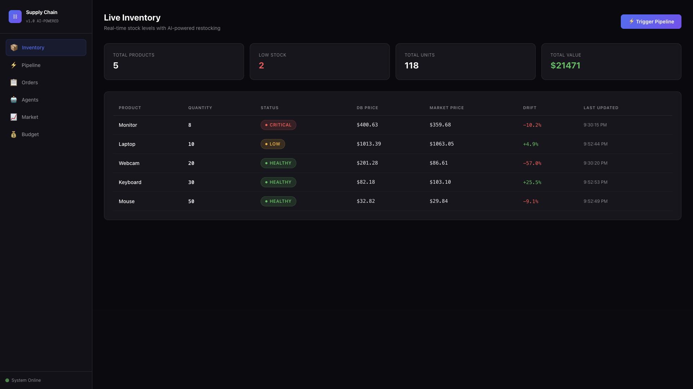
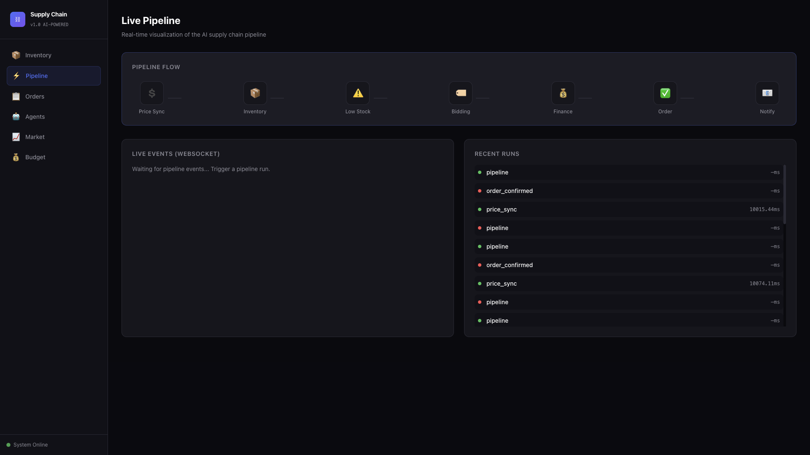
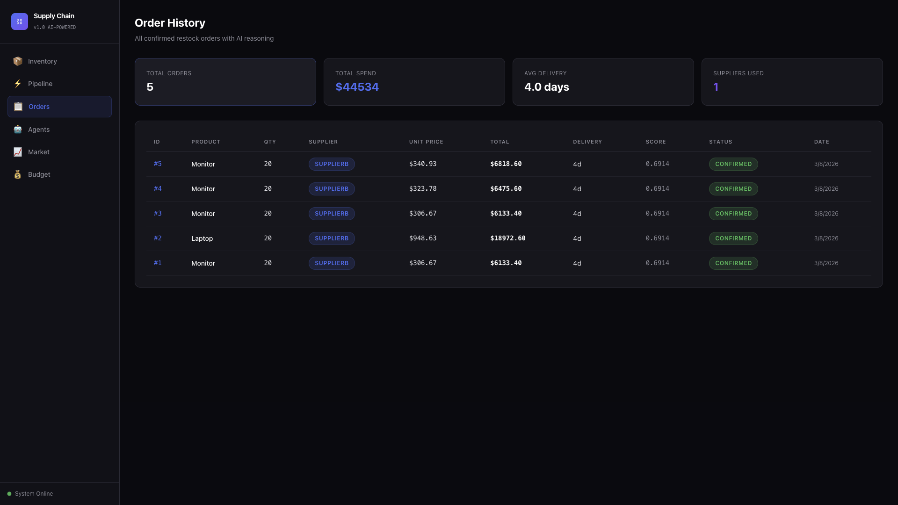
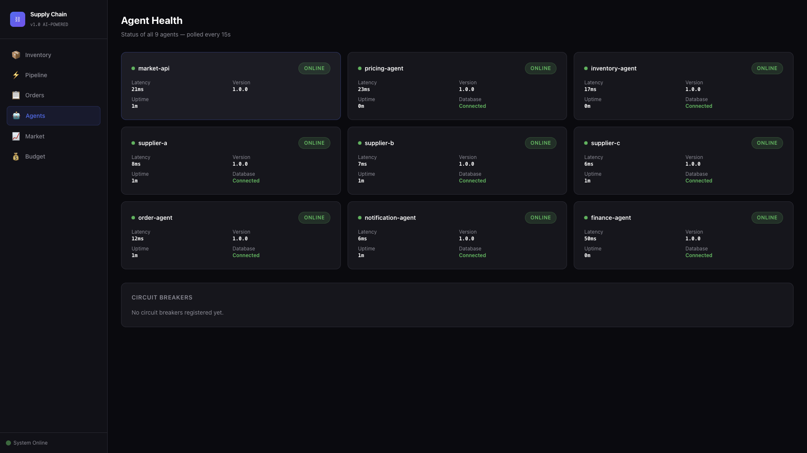
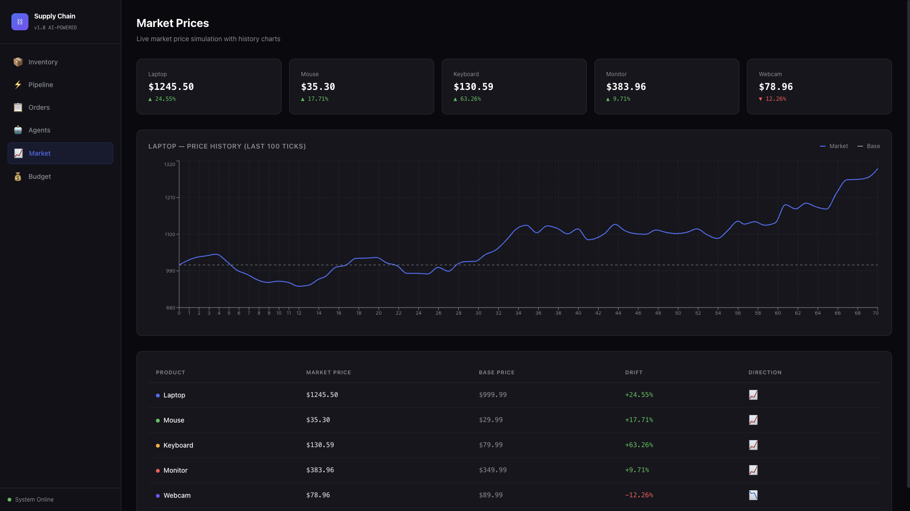
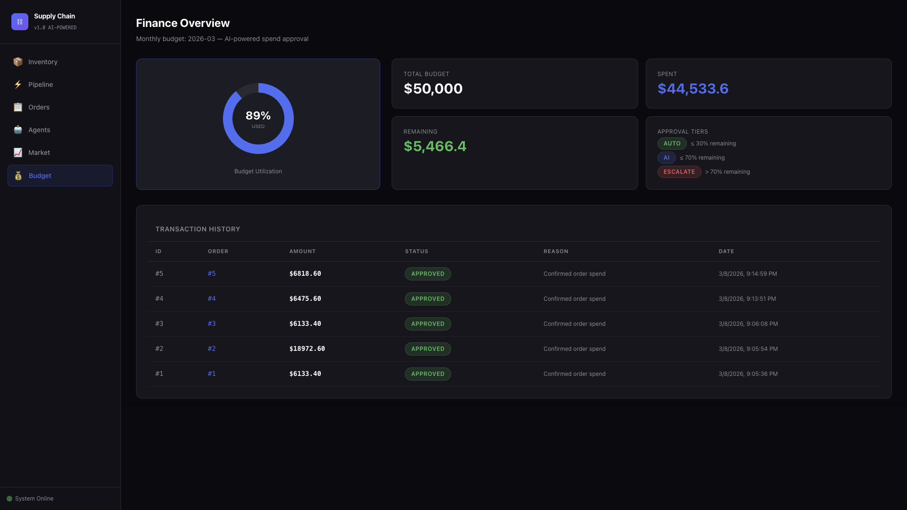

# AI Supply Chain System v1.0



This repository contains a state-of-the-art **Multi-Agent AI Supply Chain System**. It heavily utilizes the **Model Context Protocol (MCP)** and **Agent-to-Agent (A2A)** communication, leveraging Google Gemini 2.5 Flash, PostgreSQL (pgvector), Redis, Celery, and a modern Next.js 14 frontend dashboard.

The system orchestrates **9 independent Python FastAPI microservices**, each acting as a specialized AI agent responsible for a distinct part of the supply chain lifecycle. This creates a fully autonomous, self-healing pipeline that tracks volatile markets, dynamically adjusts pricing, monitors inventory, negotiates with multiple suppliers, makes purchasing decisions, handles finance approvals, and sends necessary notifications.



## 🚀 Key Features

*   **Fully Autonomous Agents:** 9 distinct agents that reason, plan, and communicate via APIs and background queues without human intervention.
*   **Real-time Dynamic Pricing:** Adjusts product prices continuously against simulated market volatility, drift, and internal inventory levels.
*   **Intelligent Inventory Management:** Monitors stock levels against dynamic thresholds, automatically triggering restock processes when levels run low.
*   **Supplier Negotiation in Real-time:** Solicits and evaluates quotes from multiple suppliers (each with distinct pricing, reliability, and delivery times).
*   **Smart Financial Approvals:** Automatically approves routine purchases within budget constraints but flags high-value orders for escalation.
*   **Event-Driven Communication:** Celery background workers and Redis pub/sub handle complex asynchronous workflows ensuring high throughput and resilience.
*   **Modern Next.js Dashboard:** A sleek, dark-themed frontend utilizing TailwindCSS and Recharts that visualizes agent interactions, market trends, and supply chain health in real-time.



## 🔬 How Everything Works (The AI Pipeline)

The system functions around a continuous loop of interconnected, specialized agents. Here is a typical workflow:

1.  **Market API Simulates Fluctuation:** The Market API continuously generates volatile market prices and trends (accounting for drift and randomness).
2.  **Pricing Agent Adjusts Rates:** Running on a Celery beat schedule, the Pricing Agent fetches the latest market data and current inventory levels to compute an optimal selling price using Google Gemini's reasoning capabilities, then updates the PostgreSQL database.
3.  **Inventory Agent Monitors Stock:** Also running on a schedule, the Inventory Agent checks current stock levels against a predefined `RESTOCK_THRESHOLD`. If stock is low, it initiates a restock sequence.
4.  **Supplier Agent Negotiation:** The Inventory Agent concurrently requests quotes from Supplier A (High cost, fast, reliable), Supplier B (Medium), and Supplier C (Cheap, slow, less reliable).
5.  **Order Agent Makes Purchasing Decisions:** The Order Agent aggregates the responses. It uses Google Gemini to reason through the trade-offs (e.g., "Do we need this fast or cheap?") and selects the most optimal supplier quote.
6.  **Finance Agent Enforces Budgets:** Before the order is finalized, the Finance Agent evaluates it against the `MONTHLY_BUDGET`. Small orders under the `BUDGET_AUTO_APPROVE_PCT` are instantly approved. Larger ones are escalated. 
7.  **Notification Agent Dispatches Alerts:** Critical events—like low inventory, large budget approvals, or order confirmations—are sent to the Notification Agent, which triggers emails and dashboard alerts via WebSockets.



## 🧠 System Architecture & Agents

*   **`market-api`** (Port 9000): The simulated external market.
*   **`pricing-agent`** (Port 9001): Analyzes market & stock to maximize profit margins.
*   **`inventory-agent`** (Port 8000): The central hub for initiating restocking.
*   **`supplier-a, b, c`** (Ports 8011, 8012, 8013): Represent different external market vendors.
*   **`order-agent`** (Port 8001): AI decision-maker for optimal component purchasing.
*   **`finance-agent`** (Port 8003): The gatekeeper for capital expenditure.
*   **`notification-agent`** (Port 8002): The communication layer.
*   **`api-gateway`** (Port 8080): Routes frontend traffic to respective microservices.
*   **`celery-worker`**: Executes the background pipeline tasks.
*   **`frontend`** (Port 3000): Next.js React Dashboard.



## 💻 Local Setup (Full AI Engine)

To run this massive multi-agent system, ensure you have **Docker** and **Docker Compose** installed.

1.  **Clone the repository:**
    ```bash
    git clone https://github.com/Adithyan0122/mcp-to-a2a.git
    cd mcp-to-a2a/v1.0
    ```

2.  **Configure Environment:**
    Copy the example environment file and add your Google Gemini API key.
    ```bash
    cp .env.example .env
    ```
    Open `.env` and configure `GEMINI_API_KEY=your_key_here`.

3.  **Start the System:**
    ```bash
    docker compose up --build -d
    ```

4.  **Access the Dashboard:**
    Open `http://localhost:3000` in your browser. You will instantly see the AI agents working together to form a highly resilient supply web.



## 🚀 Live Demo (Mock Version)

You can deploy the Next.js frontend to [Vercel](https://vercel.com/) by pointing it to the `v1.0/frontend` directory and adding the environment variable `NEXT_PUBLIC_MOCK_MODE=true`. This will run a simulated version of the dashboard with mock data, entirely bypassing the need to deploy the 9 backend microservices.
